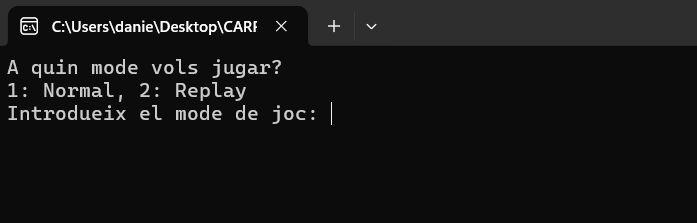

# Chess

This was the main project of the second programming course I attended the first year at university. It consists of a simple chess game that you can play in local.

## 🚀 Characteristics

- ✅ Works in local
- ✅ It is displayed using a GUI (the GUI was provided by the professor of the course)
- ✅ Playable with mouse
- ✅ Offers two modes: Play (allows you to play a new match) and Replay (lets you see the last played match, each time you click it replicates in order the movements made in that match)

## 📸 Screenshots




## 🛠️ Language used

- C++

## 📦 Installation

- 1️⃣ Clone the repo
- 2️⃣ Once in local go to /2. Platforms/0. Windows Desktop/Program/
- 3️⃣ Execute MP_Practica.exe

```bash
git clone https://github.com/DaBM17/Chess
cd Chess
